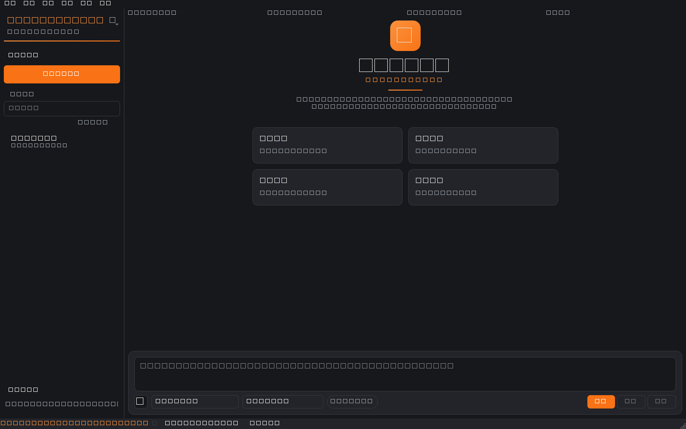
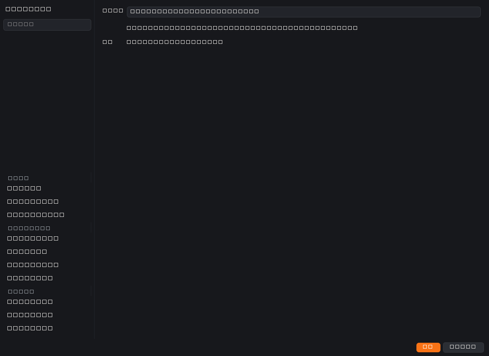
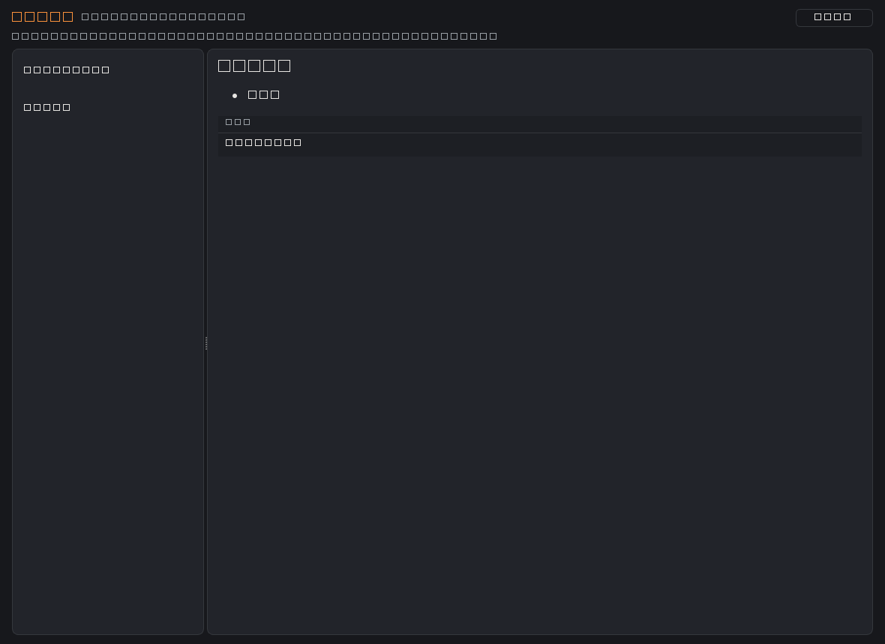

<div align="center">


# Miderforge

**会成长的桌面 AI Agent —— 记忆 · 技能库 · 类人学习 · 自我成长**

*类 Codex/ZCode 的壳，内部是一套以「记忆分层」为核心加强的 Agent 系统。*
*干得越多，越懂你，越熟练。*

[](LICENSE)
[](https://isocpp.org)
[](https://www.qt.io)
[](#-快速开始)
[](#-快速开始)

[](https://github.com/SiliconCoderJames/miderforge/actions/workflows/ci.yml)
[](docs/CONFIG.md)
[](https://www.buymeacoffee.com/zwj8jc5rrgp)

**[快速开始](#-快速开始) · [功能特性](#-功能特性) · [安全边界](#-安全边界) · [质量与验证](#-质量与验证) · [文档](#-文档) · [Roadmap](#%EF%B8%8F-roadmap) · [姊妹项目 MiderHive](#-同作者姊妹项目miderhive)**

</div>

---

## 📖 简介

Miderforge 是一款可长期驻留的 Windows 桌面 AI Agent。你用中文下达目标，它自主进行多轮 **规划 → 执行 → 观察 → 反思**，以受限方式操作本机文件与命令，直到任务完成。

而它真正的差异化在**成长性**：任务结束后自动提炼「结果摘要 → 会话摘要 → 核心记忆改写 → 失败教训」沉淀进分层记忆，并同步失效被新知覆盖的旧记忆；方案成熟的任务自动固化为一项可复用技能。下次遇到同类目标，它会先想起你的偏好、项目背景与上次的坑——**干得越多，越懂你，越熟练**。

> 记忆分层的设计映射计算机存储体系（寄存器 → SRAM → RAM → FLASH → 磁盘），每层有各自的容量、速度与管理策略，详见 [docs/MEMORY-DESIGN.md](docs/MEMORY-DESIGN.md)。

三大核心资产（项目的灵魂）：

| 资产 | 说明 |
|---|---|
| 🧠 **记忆** | L0–L3 分层记忆：核心记忆常驻注入、会话摘要滚动、档案库全文（FTS5）+ 语义（向量 RRF）混合检索，带一致性失效与容量纪律 |
| 🧰 **技能库** | 成功任务方案自动固化为可复用 `SKILL.md`（agentskills.io 风格），带使用统计与自动降权 |
| 🗄️ **数据库** | SQLite（WAL + FTS5 trigram）承载记忆/技能/任务/事件的全量持久化与审计 |

> 🐝 单体成长之外，同作者姊妹项目 [MiderHive](https://github.com/SiliconCoderJames/MiderHive) 为所有 AI Agent 提供本地共享蜂巢——Miderforge 的记忆与技能资产可带入蜂巢跨 Agent 共享，详见下文[同作者姊妹项目](#-同作者姊妹项目miderhive)一节。

## ✨ 功能特性

**🧠 记忆与成长（核心卖点）**

- 🧠 **分层记忆** — L0–L3：核心记忆常驻注入、会话摘要滚动、档案库 FTS5 + 语义向量混合检索（RRF 融合，嵌入失败自动降级），Agent 越用越懂你
- 🔄 **一致性失效 + 矛盾扫描** — 收尾改写核心记忆时归档被覆盖的旧档案；「🔍 矛盾扫描」检测相似冲突对供人工裁决
- 🧰 **技能库自沉淀** — 成功任务方案自动固化为 `SKILL.md`，带使用统计与自动降权，渐进披露加载
- 🌱 **类人学习闭环** — 每任务结束由 LLM 提炼摘要/教训/偏好改写入库，下个任务动态检索注入，形成正循环

**🤖 执行与安全**

- 🤖 **自主 Agent 循环** — ReAct 状态机，轮数熔断、增量 token 预算、死循环检测三重保险
- 🔀 **多供应商路由** — 智谱 / DeepSeek 直连，fast/main/flagship 三档路由，故障转移 + 冷却自动回切
- 🔐 **三档权限** — Suggest / Auto Edit / Full Access（Codex 式），永不解禁清单，API Key 由 Windows DPAPI 加密存储
- 🛡️ **Windows 沙箱** — 权限门 + QProcess 环境白名单 + Job Object（超时/内存上限/退出连带终止）
- 🧱 **越界三层拦截** — 工作区写边界按**真实路径**判定（junction/symlink 无法绕出）、读取侧保护区任何档位拒绝、白名单内命令的任意执行向量（`cmake -P`、`git !`/--exec 等）在 spawn 之前就被拒——明细见[安全边界](#-安全边界)
- 📋 **任务队列** — 定时任务、每日重复、执行中目标自动排队，异步完成通知
- 📧 **通知触达** — 任务完成/失败/熔断 → SMTP 邮件（RFC 2047 中文标题）+ 系统托盘气泡
- 🌊 **流式对话** — 思考过程与正文分栏展示，SSE 分帧解析，断线指数退避自动重试

**🖥️ 界面与交互**

- 🗂️ **会话管理** — 左栏会话列表：**行内直操作图标**（悬停出现「钉住 / 归档」）、双击重命名、右键菜单、按标题过滤、「显示已归档」开关；归档只打时间戳，消息与检索索引原样保留
- 📄 **内置查看器** — 工作区文件浏览器（`Ctrl+8`）：Markdown 按标题分级/列表/代码块渲染，HTML 经净化后渲染（无脚本执行面），其余文本等宽预排版；可切源码编辑，保存经权限门
- ✍️ **正文排版** — 模型输出按 Markdown 块级渲染：标题分级、列表缩进、引用块、分隔线、代码块带语言标签、行高 165%；回复底部附「模型 · 时间」脚注
- 🎨 **设计刻度** — 字号/间距/控件高度统一到一套刻度（4px 间距刻度 + 三档控件高度），四套皮肤（品牌熔炉 + Codex/VS/Claude 致敬）跟随色板

## 🛡️ 安全边界

Miderforge 会在你的电脑上读写文件、执行命令——因此安全不是"注意一下"，而是**在每个通道上都留了可验证的拦截**。以下均为代码 + 测试层已落地项：

| 攻击面 | 现状 |
|---|---|
| **写越界**（junction / symlink 指向工作区外） | 写边界改为**逐组件解析真实路径**后判定，越界直接拒绝；FileTools 内还有一层独立复核（防未来绕过权限门的调用点） |
| **读通道**（应用自身数据：DPAPI 密文、数据库、记忆、审计日志、锁文件） | 读取侧保护区**任何权限档都拒绝**，并记 `read_denied`（actor/authorizer/target/operation/outcome/reason 六元组齐全）；`list_dir`/`search_files` 逐项过滤并回报 `skipped_protected` |
| **命令白名单内的任意执行** | `cmake -P`（脚本执行）、`cmake -E env/chdir`、`git !`/`-c`/`--exec`/`config` 写入形态、`diskpart`/`cipher /w` 等一律拒绝，且**拒绝先行于 spawn**——对抗用例用 canary 文件证明命令确实没跑 |
| **持久化投毒**（记忆/技能被污染后长期影响后续任务） | ① 收尾改写核心记忆若含外发 URL 或凭据特征 → 拒绝落盘并记 `memory_rewrite_flagged`（附新旧 diff 摘要）；② 任务期间发生过越界/拒绝 → 不固化技能，记 `skill_solidify_denied`；③ 供应商故障转移发生时 Full Access 自动降为 Auto Edit，记 `permission_downgrade_on_failover` |
| **隐蔽字符注入** | 记忆写入前扫描不可见 Unicode 全谱（零宽字符、词连接符、方向隔离符、双向覆盖、变体选择符含增补平面、BOM、软连字符等）与中英注入词面；按**码点**判定，emoji 正常放行 |
| **改动失控** | 仓库根 `SECURITY-CRITICAL.txt` 列出安全关键文件：触及即需人工 review，清单**只许追加、不许移出**（规则见 [docs/CONTRIBUTING.md](docs/CONTRIBUTING.md)） |

> 威胁模型与漏洞披露流程见 [docs/SECURITY.md](docs/SECURITY.md)；历史审查处置结论与已知边界见 [docs/ACCEPTANCE.md](docs/ACCEPTANCE.md)。

## 📸 界面

<div align="center">
  
  <br><sub>💬 会话视图 — 左栏会话列表（行内钉住/归档图标 · 「显示已归档」开关）+ 空态引导卡</sub>
  <br><br>
  
  <br><sub>⚙️ 设置 — 左导航 + 内容页（功能面板收进设置，主界面只留"会话"这一件事）</sub>
  <br><br>
  
  <br><sub>📄 内置查看器 — 工作区文件 + Markdown/HTML 渲染预览（可切源码编辑）</sub>
</div>

> 上述截图由离屏探针（`mider_ui_probe`）从**真实控件**抓取，避免文档长期挂着旧版界面图；面板类截图（记忆/供应商/技能/任务/审计）位于 [docs/assets/screenshots/](docs/assets/screenshots/)。

## 🚀 快速开始

> **前置条件**：Windows 10+ · Visual Studio 2026 (MSVC v18) · CMake ≥ 3.24 · vcpkg · Qt 6.8 Widgets —— 环境问题见下方[常见问题](#-常见问题)。

```bat
:: 1. 获取 vcpkg（已有可跳过）
git clone https://github.com/microsoft/vcpkg C:\vcpkg
C:\vcpkg\bootstrap-vcpkg.bat -disableMetrics

:: 2. 配置 + 构建（vcpkg manifest 自动安装依赖；环境问题见下方常见问题）
set VCPKG_ROOT=C:\vcpkg
cmake --preset win64
cmake --build --preset win64-release

:: 3. 运行测试（必须全绿）
ctest --preset win64-release

:: 4. 启动
build\Release\miderforge.exe
```

首次启动会弹出**配置向导**：填入大模型 API Key（[智谱](https://open.bigmodel.cn) / [DeepSeek](https://platform.deepseek.com)），Key 经 Windows DPAPI 加密后本地存储，绝不落明文、绝不上传。

## ❓ 常见问题

<details>
<summary><b>configure 报「Could not find any instance of Visual Studio」或生成器不存在？</b></summary>
<br>

预设使用 VS 2026 生成器（`Visual Studio 18 2026`）。VS 2022 用户请把 `CMakePresets.json` 中的 `generator` 改为 `"Visual Studio 17 2022"`。

</details>

<details>
<summary><b>Qt 不在默认路径？</b></summary>
<br>

修改 `CMakePresets.json` 中的 `CMAKE_PREFIX_PATH`，指向你的 Qt 目录（如 `C:/Qt/6.8.3/msvc2022_64`）。

</details>

<details>
<summary><b>configure 报 <code>VCPKG_ROOT</code> 未设置？</b></summary>
<br>

先设环境变量再配置：cmd 用 `set VCPKG_ROOT=C:\vcpkg`，PowerShell 用 `$env:VCPKG_ROOT="C:\vcpkg"`。

</details>

<details>
<summary><b>测试怎么跑？</b></summary>
<br>

在**源码根目录**执行 `ctest --preset win64-release`（预设自动定位构建目录），它会跑 7 个目标：单元测试 + 4 个对抗套件 + 2 个验收套件。也可直接运行 `build\Release\mider_tests.exe` / `build\Release\mider_adversarial_tests.exe`。

</details>

<details>
<summary><b>归档按钮在哪？点了「显示已归档」怎么没反应？</b></summary>
<br>

两者是不同的事：**归档动作**在会话行的右侧——鼠标移到会话行上会出现两个图标（左：钉住，右：归档盒），点归档盒即归档；右键菜单里也有「归档会话 / 置顶会话」。而「**显示已归档**」是列表的**显示开关**（默认隐藏归档项，勾上就把它们也列出来，可再点图标取消归档）。

归档只写一个时间戳：消息、全文索引、记忆全部保留，随时可复原。

</details>

<details>
<summary><b>为什么我发一条任务，它秒失败、什么都没干？</b></summary>
<br>

多半是**当前激活的供应商没配 API Key**。审计日志里会留下明确原因（例如 `供应商 zhipu 未配置 API Key，请先完成首次配置`）。到 **设置 → 模型与供应商** 补上 Key，或把激活供应商切到已配置的那一家即可。可用「测试连接」按钮先验证连通性。

</details>

<details>
<summary><b>我让它做件事，它只是回答了一段文字，没有生成文件？</b></summary>
<br>

这是模型选择的结果，不是功能失效：如果目标是**知识问答**（例如"bat 里怎么输出文本"），它会直接用文字回答，**不会调用任何工具**——审计日志里能看到该任务没有 `tool_call`/`tool_result` 事件。想让它动文件，把目标写成**动作请求**（"在工作区新建 `说明.md`，写入 ……"）即可。

写文件能力本身有端到端验收用例覆盖：Auto Edit 档下写入的文件内容逐字节一致（含自动创建父目录）；Suggest 档下**未点确认前磁盘上不会出现文件**。

</details>

<details>
<summary><b>配置和数据存在哪？如何完全重置？</b></summary>
<br>

配置、SQLite 数据库、DPAPI 加密的 API Key 与记忆/技能文件都在 `%APPDATA%\Miderforge\Miderforge`（Qt `AppDataLocation` 会同时拼接组织名与应用名，两者都是 `Miderforge`，故为两层同名目录）；主题皮肤由 QSettings 存于注册表 `HKCU\Software\Miderforge\Miderforge`。要完全恢复出厂：删除该数据目录**并**清理上述注册表键，仓库目录内不落任何运行时数据。

</details>

## 📚 文档

| 文档 | 说明 |
|---|---|
| 🧠 [docs/MEMORY-DESIGN.md](docs/MEMORY-DESIGN.md) | 记忆分层设计：存储体系类比、每层管理策略、一致性失效机制 |
| 📖 [docs/CONFIG.md](docs/CONFIG.md) | 详细配置指南：供应商 Key、权限档、SMTP 通知与密钥卫生红线 |
| ✅ [docs/ACCEPTANCE.md](docs/ACCEPTANCE.md) | 逐条验收清单、审查处置结论与设计取舍 |
| 🤝 [docs/CONTRIBUTING.md](docs/CONTRIBUTING.md) | 贡献指南：开发环境、代码风格、测试与提交要求、安全资产硬约束 |
| 🔒 [docs/SECURITY.md](docs/SECURITY.md) | 安全策略：漏洞报告流程、安全设计要点 |
| 🗂️ [SECURITY-CRITICAL.txt](SECURITY-CRITICAL.txt) | 安全关键文件清单（触及须人工 review；清单只增不减） |

## 🏗️ 架构

```
┌─────────────────────────────────────────────────────────────┐
│                  Qt 6 Widgets 深色 UI（单列左栏 + 内容区）    │
│   会话 / 内置查看器 / 设置（内嵌：任务队列·技能·记忆·供应商·审计）│
├──────────────┬──────────────────────────────┬───────────────┤
│  core/       │  llm/                        │  tools/       │
│  AgentLoop   │  ChatClient（厂商兼容层）     │  ToolRegistry │
│  Scheduler   │  HttpClient(curl 工作线程)   │  PermissionGate│
│  Router      │  SseParser / SSE 分帧        │  Sandbox      │
├──────────────┴──────────────────────────────┴───────────────┤
│   memory/ 分层记忆        db/ SQLite(WAL+FTS5)               │
│   skills/ 技能自沉淀      notify/ SMTP + 托盘                │
└─────────────────────────────────────────────────────────────┘
```

构建分两层静态库：`mider_core`（QtCore 级，无 UI 依赖，单测只链接它）+ `mider_ui`（Widgets 层）。

## 🧪 质量与验证

**测试矩阵（实测输出，非申报）**

| 目标 | 规模 | 状态 |
|---|---|---|
| `mider_tests`（单元） | **137 用例 / 706 断言** | 全绿 |
| `adversarial.*`（对抗，4 套件） | workspace_boundary · read_channel · command_whitelist · persistence_poisoning | 全绿 |
| `acceptance.*`（验收，2 套件） | write_file · session_management | 全绿 |
| 合计 | **168 用例 / 1083 断言**（`ctest --preset win64-release` 7/7 通过） | — |

**对抗用例是资产，不是普通测试**：`tests/adversarial/` 下的用例不许删、不许 skip，安全行为的任何变更都必须带新的对抗用例或加强既有用例（规则见 [docs/CONTRIBUTING.md](docs/CONTRIBUTING.md)）。典型手法是 **canary**：把攻击命令设计成"若真被执行就会在工作区留下文件"，然后断言那个文件不存在。

**UI 几何探针** `mider_ui_probe`：离屏构造真实 `MainWindow`，把控件树、几何、最小尺寸、风格一致性（间距/内边距/控件高度种类数）打成可读数字，并可从真实控件抓图。它让"看不到界面"时的布局问题变成可测量、可回归的对象（设置页曾被自身最小宽度撑出屏幕，就是它定位的）。

**真机验收**：涉及真实大模型 Key、SMTP 授权码的端到端链路**尚未逐条实测**（明细见 [docs/ACCEPTANCE.md](docs/ACCEPTANCE.md) 中留空的验收项）。首次配置 Key 后建议先跑一个小任务自行复核。

## 📁 目录结构

<details>
<summary><b>展开查看目录结构</b></summary>
<br>

```
Miderforge/
├── src/
│   ├── app/        # Qt 界面：主窗口、会话视图、左栏（会话行委托）、设置、查看器、主题
│   ├── core/       # AgentLoop 状态机、任务调度、三档路由、会话查询契约
│   ├── llm/        # HttpClient(curl)、SseParser、ChatClient、EmbeddingClient、ProviderManager
│   ├── memory/     # 分层记忆（L1 文件 + L3 库）与 FTS5 检索
│   ├── skills/     # SKILL.md 读写、自沉淀闭环、使用统计
│   ├── tools/      # 工具注册表、文件/命令工具、权限门、沙箱
│   ├── db/         # SQLite 打开/迁移（含后补列）/FTS5 挂载
│   ├── notify/     # SMTP 邮件、托盘通知
│   └── util/       # DPAPI、真实路径解析、日志、目录、token 估算、JSON 提取
├── tests/          # doctest 单元测试 + adversarial/（对抗与验收套件）
│                   # 另含 ui_probe：离屏构造真实主窗口的几何/一致性探针（诊断工具，不参与发布）
├── docs/           # 设计/配置/验收文档 + CONTRIBUTING.md + SECURITY.md + 界面截图
├── resources/      # 非代码资源：assets/（图标与 app.rc）· config/（配置模板）· scripts/（图标生成）
├── third_party/    # SQLite amalgamation · sqlite-vec（内置源码，离线可构建的前提）
├── .github/        # CI 工作流与资助配置
└── SECURITY-CRITICAL.txt / STATUS.md   # 安全关键文件清单 / 当前进度与遗留
```

> 仓库根只保留构建入口与元数据（`CMakeLists.txt` · `CMakePresets.json` · `vcpkg.json` ·
> `README.md` · `LICENSE` · `.gitignore` · `.gitattributes` · `SECURITY-CRITICAL.txt` · `STATUS.md`），
> 其余一律归档到上面各目录。构建产物落在源码树下的 `build/`（见 `CMakePresets.json` 的 `binaryDir`）。

</details>

## 🗺️ Roadmap

| 里程碑 | 内容 | 状态 |
|:---:|---|:---:|
| **M0** | 通信管道：SSE 流式 / 双供应商直连 / 工具往返 / 断线重试 | ✅ 单测覆盖（真实 Key 端到端待复核） |
| **M1** | Agent 循环 + 9 工具 + 三档权限 + Windows 沙箱 + 审计日志 | ✅ 单测覆盖（真实 Key 端到端待复核） |
| **M2** | SQLite 四表 + FTS5 分层记忆 + 任务队列 | ✅ 单测覆盖（真实 Key 端到端待复核） |
| **M3** | 技能库 + 自沉淀闭环 | ✅ 单测覆盖（真实 Key 端到端待复核） |
| **M4** | 三档路由 + 故障转移 + 托盘 + 邮件通知 | ✅ 单测覆盖（SMTP / 故障转移待人工验证） |
| **M4.5** | 记忆分层强化：一致性失效 / L1 容量纪律 / 增量 token 记账 / L2 淘汰评分化 / 跨层预取 | ✅ 单测覆盖（真实 Key 端到端待复核） |
| **M5** | 中断分级：四级中断模型（系统/熔断/用户/操作级）、暂停恢复、取消令牌传导、checkpoint 续跑 | ✅ 单测覆盖（GUI 交互待人工验证） |
| **P0** | 安全加固一：工作区**真实路径**写边界 / 读取侧保护区（应用自身数据任何档位拒绝）/ 白名单内命令执行向量拦截（拒绝先行于 spawn） | ✅ 对抗套件 3 个（含 canary 取证） |
| **P1** | 安全加固二：持久化投毒防护三场景（记忆改写拦截 / 越界不固化技能 / 故障转移降权）+ 对抗资产与关键文件清单规则 | ✅ 对抗 + 验收套件 |
| **UI** | 界面能力：设计刻度与排版加档、侧栏分隔线、设置页布局修复、会话归档/置顶（行内图标）、内置查看器、Markdown 分级渲染 | ✅ 探针量化 + 单测 + 端到端用例 |
| **M6** | 生态互通：L3 语义检索 ✅（FTS5 + 向量 RRF 混合，需在设置→供应商页显式启用嵌入）｜[MiderHive](https://github.com/SiliconCoderJames/MiderHive) 蜂巢接入 📋 仅完成设置页与连通性探测，其余待实现 | 🚧 进行中 |

**距离第一个正式 Release（v1.0）还差什么**（如实列出）：

| 门槛 | 状态 |
|---|---|
| 自动化测试全绿（单元 + 对抗 + 验收） | ✅ 168 用例 / 1083 断言 |
| 安全加固与对抗资产 | ✅ P0 / P1 已落地 |
| 界面能力与一致性 | 🚧 持续打磨中（见 Roadmap UI 行） |
| **真实 Key 全链路人工验收** | ❌ 未完成（13 项，见 [docs/ACCEPTANCE.md](docs/ACCEPTANCE.md)） |
| **安装包与发布流水线** | ❌ 未开始（当前仅源码构建 + 本地 exe） |

> ⚠️ **验证状态说明（请务必阅读）**：上表 ✅ 表示**代码与自动化测试层面已完成**，但除自动化测试外的端到端链路（真实大模型 Key 下的完整任务闭环、SMTP 邮件、故障转移、托盘通知）**尚未逐条实测**——明细见 [docs/ACCEPTANCE.md](docs/ACCEPTANCE.md) 中留空的验收项。首次配置 Key 后建议先跑一个小任务自行复核。

## 🐝 同作者姊妹项目：MiderHive

Miderforge 是一只**单体的蜜蜂**。而当你桌面上同时跑着 Claude Code、Codex CLI、Cursor 等多个 AI Agent 时，它们彼此并不认识：各自记笔记、重复踩坑、反复问你同样的问题、无法互相委托任务。同作者的姊妹项目 [**MiderHive**](https://github.com/SiliconCoderJames/MiderHive)（本地多 Agent 协作平台，原名 AgentHive，已更名）就是它们的**蜂巢**——纯本地运行，服务只监听 `127.0.0.1:8787`，无账号、无云依赖，全部数据就是一个本机 SQLite 文件；与 Miderforge 同款技术栈（C++20 / Qt 6 / SQLite WAL + sqlite-vec），同一作者维护。

> **当前实现状态（请勿误读）**：Miderforge 侧**只完成了设置页与连通性探测**——设置→蜂巢页可填写地址/Agent 名称/主密钥（DPAPI 加密），并可对 `127.0.0.1:8787` 的 `/api/health` 做一次握手测试；`config/hive.json` 目前**没有任何运行时组件读取**，下方能力与对接均为**规划**，尚未打通。MiderHive 侧的能力请以其自身仓库为准。相关规划见 Roadmap M6。

蜂巢规划提供七类共享能力：

| 模块 | 作用 |
|---|---|
| 🧠 共享知识库 | 跨 Agent 沉淀经验 / 方案 / 踩坑，关键词 + 语义双模式检索（sqlite-vec，嵌入器可插拔） |
| 🛠️ 技能市场 | Agent 注册自己擅长的技能供其他 Agent 检索调用——先注册后调用、调用留痕 |
| 🧑 共享用户记忆 | 项目进度、编码偏好、工作习惯、设备环境全 Agent 共享，不再重复询问 |
| 💬 异步委托 | note / question / task 三类消息 + 任务状态机，不要求双方同时在线 |
| 🚨 错误互助 | 报错强制入日志，其他 Agent 可接手解决；解决说明只追加、不覆盖 |
| 📊 Token 观测 | 跨 Agent 用量按周聚合 + 80% / 95% / 超限三级告警（仅观测，不限制） |
| 🧾 全程审计 | 所有操作留痕可回溯，过期记录自动清理，支持备份恢复 |

**规划中的**单体资产与蜂巢模块对应关系（Roadmap M6，尚未实现）：

| Miderforge 单体资产（本地私有） | 规划：接入蜂巢后（跨 Agent 共享） |
|---|---|
| 🧰 技能库 `SKILL.md` | 注册进技能市场，被 Claude Code / Codex / Cursor 检索与调用 |
| 🧠 L2 会话摘要 / L3 档案 | 任务收尾沉淀进共享知识库，关键词 + 语义双检索命中 |
| 🧑 核心记忆中的偏好与背景 | 与蜂巢用户记忆互通，任何 Agent 不再重复问 |
| 📊 增量 token 记账 | 上报蜂巢周用量观测，多 Agent 汇成一张图 |
| 📋 任务队列 | 接收其他 Agent 委派的 note / question / task，异步完成 |

规划中的接入步骤（对任何能发 HTTP 请求的 Agent 开放；Miderforge 自身尚未实现）：

1. `agent-cli register` 注册蜂巢身份（主密钥仅首次注册时使用）；
2. 把磨熟的 `SKILL.md` 方案注册进蜂巢技能市场，其他 Agent 检索后可直接调用；
3. 任务收尾把可复用经验沉淀进共享知识库——个人记忆仍留在本地 L0–L3 分层体系，私密内容不出 Miderforge。

单体负责成长，蜂巢负责共享——**单体越强，蜂巢越富；蜂巢越富，每只蜜蜂越省。**

## 🤝 贡献

欢迎 Issue 与 PR！提交前请阅读 [docs/CONTRIBUTING.md](docs/CONTRIBUTING.md)，要点：

1. 保持既有代码风格（中文注释、`m_` 成员前缀、命名空间 `miderforge`）；
2. 为纯逻辑改动补充 doctest 单测，并保持全绿；
3. **对抗用例不许删、不许 skip**：`tests/adversarial/` 是安全回归资产，安全行为变更必须带新用例；
4. **触及安全关键清单须人工 review**：`SECURITY-CRITICAL.txt` 内的文件改动不得自动合并，且清单只许追加；
5. 通过密钥自检：`git ls-files | findstr /i "key secret token env pass"`，确认无敏感值入库。

## 🔒 安全

**Miderforge 会在你的电脑上读写文件并执行命令。** 请从 **Suggest** 权限档开始使用；敏感路径任何档位下均被硬拦截；所有操作记录于本地审计日志。具体的拦截面与验证方式见上文[安全边界](#-安全边界)。

安全漏洞请**勿**公开 Issue，优先通过邮件私下披露——完整流程见 [docs/SECURITY.md](docs/SECURITY.md)。

## 📬 社区与反馈

| 渠道 | 链接 |
|---|---|
| 🐛 Bug 反馈 / 功能建议 | [Issues](https://github.com/SiliconCoderJames/miderforge/issues) |
| 💡 讨论交流 | [Discussions](https://github.com/SiliconCoderJames/miderforge/discussions) |
| 📧 邮件（合作/安全漏洞） | 13371891127@139.com |

## ☕ 赞助支持

如果 Miderforge 帮你省下了时间，欢迎请作者喝杯咖啡 ☕——所有赞助将用于 API 调用测试经费与后续开发。

<div align="center">
  <a href="https://www.buymeacoffee.com/zwj8jc5rrgp" target="_blank">
    
  </a>
  <br><br>
  
  <br><sub>扫码直达赞助页 · Scan to buy me a coffee</sub>
</div>

**其他方式：**

- **GitHub Sponsors** — 仓库首页右上角 **♥ Sponsor** 按钮（[.github/FUNDING.yml](.github/FUNDING.yml) 已配置）
- **微信 / 支付宝收款码** — 暂未开放，开放后会在此补充

## 📄 License

[MIT](LICENSE) © 2026 Miderforge Contributors
